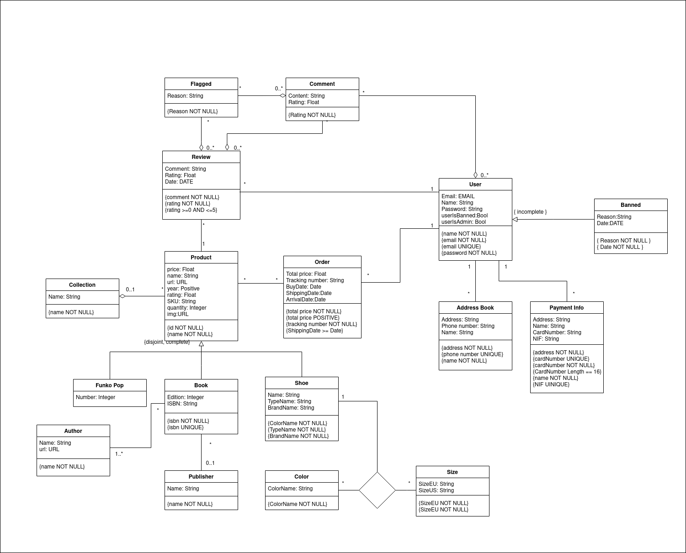

# EBD: Database Specification Component

> Project vision.

## A4: Conceptual Data Model

> Brief presentation of the artefact goals.

### 1. Class diagram

> UML class diagram containing the classes, associations, multiplicity and roles.\
> For each class, the attributes, associations and constraints are included in the class diagram.



### 2. Additional Business Rules

ABR.01: A user can only make a review on a previously purchased item.\
ABR.02: A user can't buy more than the available quantity.\
ABR.03: A user can only review a specific product once.

---

# A5: Relational schema, validation and schema refinement

This artifact contains the relational schema obtained by mapping the domain model, which will also be presented in SQL. The relational schema includes each relation, attributes, domains, primary keys, foreign keys and other integrity rules: UNIQUE, NOT NULL, DEFAULT, CHECK.
 In order to validate said schema, the identification of all functional dependencies is needed, as well as the normalization of the relational schema, according to the 
 Boyce-Codd Normal Form(BCNF).

## 1. Relational Schema

|Relation reference | Relation Compact Notation                  |
|------------------ | -------------------------------------------|
| R01               | users(__id__, name __NN__, email __NN__ __UK__,password __NN__ , user_is_banned, user_is_admin)|
| R02               | banned(__id__, reason __NN__, date __NN__, id_user -> users)|
| R03               | addressBook(__id__, adress __NN__, phone_number __UK__, name __NN__, id_user -> users) |
| R04               | paymentInfo(__id__, adress __NN__ , name __NN__, card_number __UK__ __NN__ __CK__ LENGTH(card_number) == 16 , nif __UK__, id_user -> users) |
| R05               | ord(__id__, total_price __NN__ total_price > 0, tracking_number __NN__, buy_date __DF__ Today, shipping_date __DF__ Today shipping_date >= buy_date, arrival_date, id_user -> users)|
| R06               | review(__id__, comment __NN__ , rating __NN__ __CK__ rating >= 0 AND rating <= 5, date __DF__ Today, id_product -> product, id_user -> users) |
| R07              | flagged(__id__, reason __NN__, id_review -> review))|
| R08               | comment(__id__, content, rating __NN__, id_user -> users, id_review -> review)|
| R09               | product(__id__ , price, name __NN__, year __CK__ year > 0, rating, sku, quantity, id_collection -> collection)|
| R10              | productOrd(__id_product__ -> product, __id_order__ -> ord)|
| R11               | funkoPop(__id_funko_pop__ -> product, number)|
| R12               | book(__id_book__ -> product, id_author -> author, id_publisher -> publisher, edition, isbn __UK__ __NN__)|
| R13               | author(__id__, name __NN__) |
| R14               | authorBook(__id_author__ -> author, __id_book__ -> book)|
| R15               | publisher(__id__, name __NN__)|
| R16               | shoe(__id_shoe__ -> product, id_size -> size, name, typename __NN__, brandname __NN__) |
| R17               | collection(__id__, name __NN__)|
| R18               | color(__id__, id_shoe -> shoe, colorname __NN__)|
| R19               | size(__id__, size_eu __NN__, size_us __NN__)|
| R20               | shoeColorSize(__id_shoe__ -> shoe, __id_color__ -> color, __id_size__ -> size)|
 

### legenda: 
  
  - UK = UNIQUE KEY
  - NN = NOT NULL
  - DF = DEFAULT
  - CK = CHECK

## 2. Domains

| Domain Name | Domain Specification   |
| ----------- | --------------------   |
| Today       | DATE DEFAULT CURRENT_DATE |

## 3. Schema validation
  
  | **TABLE R01**   |  users           |
  | ----------------|  ---            |
  | **keys**         |  {id},{email}   | 
  | **Functional Dependencies:**   |
  | FD0101           | {id} -> {email, name, password, user_is_banned, user_is_admin}|
  | FD0102           | {email} -> {id, name, password, user_is_banned, user_is_admin} |
  | **NORMAL FORM**  |  BCNF |
 

  | **TABLE R02**   |  banned           |
  | ----------------|  ---            |
  | **keys**         |  {id}   | 
  | **Functional Dependencies:**   |
  | FD0201           | {id} -> {reason,date, id_user}|
  | **NORMAL FORM**  |  BCNF |


  | **TABLE R03**   |  addressBook        |
  | ----------------|  ---            |
  | **keys**         |  {id},{phone_number}| 
  | **Functional Dependencies:**   |
  | FD0301           | {id} -> {id_user, adress, name, phone_number}|
  | FD0302           | {phone_number} -> {id,id_user,adress,name}|
  | **NORMAL FORM**  |  BCNF |
 


  | **TABLE R04**   |  paymentInfo       |
  | ----------------|  ---            |
  | **keys**         |  {id}, {card_number}, {nif}  | 
  | **Functional Dependencies:**   |
  | FD0401           | {id} -> {id_user, address, name, card_number, nif}|
  | FD0402           | {card_number} -> {id, id_user, address, name, nif} |
  | FD0403           | {nif} -> {id,id_user, address, name, card_number} | 
  | **NORMAL FORM**  |  BCNF |
 

  | **TABLE R05**   |  ord       |
  | ----------------|  ---            |
  | **keys**         |  {id}  | 
  | **Functional Dependencies:**   |
  | FD0501           | {id} -> {total_price, tracking_number, buy_date, shipping_date, arrival_date, id_user}|
  | **NORMAL FORM**  |  BCNF |
  

  | **TABLE R06**   |  review        |
  | ----------------|  ---            |
  | **keys**         |  {id}  | 
  | **Functional Dependencies:**   |
  | FD0601           | {id} -> {comment, rating, date, id_user, id_product}|
  | **NORMAL FORM**  |  BCNF |
  

  | **TABLE R07**   |  flagged        |
  | ----------------|  ---            |
  | **keys**         |  {id}  | 
  | **Functional Dependencies:**   |
  | FD0701           | {id} -> {reason, id_review}|
  | **NORMAL FORM**  |  BCNF |
  

  | **TABLE R08**   |  comment        |
  | ----------------|  ---            |
  | **keys**         |  {id}  | 
  | **Functional Dependencies:**   |
  | FD0801           | {id} -> {content,rating, id_user, id_review}|
  | **NORMAL FORM**  |  BCNF |
  

  | **TABLE R09**   |  product        |
  | ----------------|  ---            |
  | **keys**         |  {id}  | 
  | **Functional Dependencies:**   |
  | FD0901           | {id} -> {price, name, year, rating, sku, quantity, id_collection}|
  | **NORMAL FORM**  |  BCNF |
  

   | **TABLE R10**   |  productOrd        |
  | ----------------|  ---            |
  | **keys**         |  {id_product,id_order}  | 
  | **Functional Dependencies:**   |
  |none|
  | **NORMAL FORM**  |  BCNF |
  

  | **TABLE R11**   |  funkoPop       |
  | ----------------|  ---            |
  | **keys**         |  {id_funko_pop}  | 
  | **Functional Dependencies:**   |
  | FD01101           | {id_funko_pop} -> {number}|
  | **NORMAL FORM**  |  BCNF |
  

  | **TABLE R12**   |  book        |
  | ----------------|  ---            |
  | **keys**         |  {id_book},{isbn} | 
  | **Functional Dependencies:**   |
  | FD01201           | {id_book} -> {id_author, id_publisher, edition, isbn}|
  | FD01202           | {isbn} -> {id_book, id_author, id_publisher, edition} |
  | **NORMAL FORM**  |  BCNF |

  | **TABLE R13**   |  author       |
  | ----------------|  ---            |
  | **keys**         |  {id}  | 
  | **Functional Dependencies:**   |
  | FD01301           | {id} -> {name}|
  | **NORMAL FORM**  |  BCNF |
  

  | **TABLE R14**   |  publisher       |
  | ----------------|  ---            |
  | **keys**         |  {id}  | 
  | **Functional Dependencies:**   |
  | FD01401           | {id} -> {name}|
  | **NORMAL FORM**  |  BCNF |

  | **TABLE R15**   |  authorBook       |
  | ----------------|  ---            |
  | **keys**         |  {id_author, id_book}  | 
  | **Functional Dependencies:**   |
  | none   | 
  | **NORMAL FORM**  |  BCNF |
  |
  

  | **TABLE R16**   |  shoe        |
  | ----------------|  ---            |
  | **keys**         |  {id_shoe}  | 
  | **Functional Dependencies:**   |
  | FD01501           | {id_shoe} -> {name, typename, brandname}|
  | **NORMAL FORM**  |  BCNF |
  

  | **TABLE R17**   |  collection    |
  | ----------------|  ---            |
  | **keys**         |  {id}  | 
  | **Functional Dependencies:**   |
  | FD01601           | {id} -> {name}|  
  | **NORMAL FORM**  |  BCNF |
  

  | **TABLE R18**   |  color   |
  | ----------------|  ---            |
  | **keys**         |  {id}  | 
  | **Functional Dependencies:**   |
  | FD01701           | {id} -> { id_shoe, colorname}|  
  | **NORMAL FORM**  |  BCNF |
  

  | **TABLE R19**   |  size   |
  | ----------------|  ---            |
  | **keys**         |  {id}  | 
  | **Functional Dependencies:**   |                  
  | FD01801           | {id} -> {size_eu, size_us}|
  | **NORMAL FORM**  |  BCNF |
  

  | **TABLE R20**   |  shoeColorSize   |
  | ----------------|  ---            |
  | **keys**         |  {id_shoe, id_color, id_size}  | 
  | **Functional Dependencies:**   |
  |none|
  | **NORMAL FORM**  |  BCNF |


  All relations are in the Boyce-Codd Normal Form(BCNF) as the relation schema.

## A6: Indexes, triggers, transactions and database population

> Brief presentation of the artefact goals.

### 1. Database Workload

> A study of the predicted system load (database load). Estimate of tuples at each relation.


| **Relation reference** | **Relation Name** | **Order of magnitude** | **Estimated growth** |
|------------------------|-------------------|------------------------|----------------------|
| R01 | users | 100k | 10(tens) /day) |
| R02 | banned | 100 | 1 /day) |
| R03 | address_book | 15k | 10(tens) /day) |
| R04 | payment_info | 15k | 10/tens) /day |
| R05 | ord | 1m | 100(hundreds) /day) |
| R06 | review | 1k | 1 /day |
| R07 | flagged | 1k | 10 /day |
| R08 | comment | 10k | 10 /day |
| R09 | product | 1k | 10(tens) /day |
| R10 | productOrd | 1m | 100(hundreds) /day |
| R11 | funkoPop | 100 | 1 /day |
| R12 | book | 100(hundreds) | 10 /day |
| R13 | author | 100(hundreds) | 1 /day |
| R14 | authorBook | 100(hundreds) | 1 /day |
| R15 | publisher | 10 | 1 /day |
| R16 | shoe | 100(hundreds) | 1 /day |
| R17 | collection | 10(tens) | 1 /day |
| R18 | color | 10(tens) | 1 /day |
| R19 | size | 10(tens) | 1 /day |
| R20 | shoeColorSize | 100(hundreds) | 1 /day |

## 2. Proposed indices

### 2.1. Performance indices

| Index  | IDX01                                                                                                                                                                                                                                
|-----------------|--------------------------------------------------|
| Index relation  |                       product                                                                                                                                                                                                          |
| Index attribute | price                                                                                                                                                                                                                             |
| Index type      | B-tree                                                                                                                                                                                                                                  |
| Cardinality     | High                                                                                                                                                                                                                                  |
| Clustering      | Yes                                                                                                                                                                                                                                   |
| Justification   |  It's useful for searching products of a certain product that have the price lower than a certain value defined much faster, It's B-tree and  claustered to allow for quick range queries.                                 |
```sql
CREATE INDEX product_price_idx ON product USING btree (price); 
```

| Index  | IDX02                                                                                                                                                                                                                                
|-----------------|--------------------------------------------------|
| Index relation  |                       address_book                                                                                                                                                                                                       |
| Index attribute | "id_user"                                                                                                                                                                                                                |
| Index type      | Hash                                                                                                                                                                                                                                  |
| Cardinality     | Medium                                                                                                                                                                                                                                  |
| Clustering      | Yes                                                                                                                                                                                                                                   |
| Justification   |  Every time we need to make a query to get the address of an user, it has to be fast, because it can be executed several times; doesn't need range query support; Filtering is done by exact match, thus an hash type is best suited; clustering is relevant because its cardinality is medium.                     |
```sql
CREATE INDEX address_iduser_idx ON addressBook USING hash (id_user);
```

| Index  | IDX03                                                                                                                                                                                                                                
|-----------------|--------------------------------------------------|
| Index relation  |   order                                                                                                                                                                                                                             |
| Index attribute |   "id_user"                                                                                                                                                                                                             |
| Index type      | Hash                                                                                                                                                                                                                                  |
| Cardinality     | Medium                                                                                                                                                                                                                                  |
| Clustering      | Yes                                                                                                                                                                                                                                   |
| Justification   |        Every time we need to make a query to get an order of any user, it has to be fast, because it can be executed several times; doesn't support range query support, Filtering is done by exact match, thus an hash type is best suited; clustering is relevant because its cardinality is medium.          |
```sql
CREATE INDEX order_iduser_idx ON ord USING hash (id_user);
```


### 2.2. Full-text Search Indices

| Index  | IDX04                                                                                                                                                                                                                                
|-----------------|--------------------------------------------------|
| Index relation  |   product                                                                                                                                                                                                                          |
| Index attribute |   name                                                                                                                                                                                                             |
| Index type      | GIST                                                                                                                                                                                                                                 |
| Cardinality     | High                                                                                                                                                                                                                                  |
| Clustering      | No                                                                                                                                                                                                                                   |
| Justification   |     To improve overall performance of full-text searches while searching for products by name. Gist is best suited because it's better to dynamic data.        |
```sql
CREATE INDEX search_product_name_idx ON product USING GIST (to_tsvector('english', name));

```


### 3. Triggers 

> User-defined functions and trigger procedures that add control structures to the SQL language or perform complex computations, are identified and described to be trusted by the database server. Every kind of function (SQL functions, Stored procedures, Trigger procedures) can take base types, composite types, or combinations of these as arguments (parameters). In addition, every kind of function can return a base type or a composite type. Functions can also be defined to return sets of base or composite values.

| **Trigger** | TRIGGER01 |
|-------------|-----------|
| **Description** | This trigger will make it so a user can only make a review on a previously purchased item. (ABR.01) |
```sql

CREATE OR REPLACE FUNCTION check_user_ownership() RETURNS TRIGGER AS
    $BODY$
    BEGIN
        IF NOT EXISTS (
            SELECT * 
            FROM productOrd WHERE productOrd.id_product = New.id_product AND
            productOrd.id_user = New.id_user) THEN
        RAISE EXCEPTION 'User doesn''t own this product so he can''t review it.';
       END IF;
       RETURN NEW;
    END
    $BODY$
LANGUAGE plpgsql;

CREATE TRIGGER check_review
        BEFORE INSERT OR UPDATE ON review
        FOR EACH ROW
        EXECUTE PROCEDURE check_user_ownership();

```

| **Trigger** | TRIGGER02 |
|-------------|-----------|
| **Description** | This trigger will it so a user can't buy more than the available quantity. (ABR.02) |
```sql

CREATE OR REPLACE FUNCTION check_if_enough_stock() RETURNS TRIGGER AS
    $BODY$
    BEGIN
        IF EXISTS (
          SELECT productOrd.quantity
          FROM productOrd, product, ord WHERE productOrd.id_product = product.id_product AND productOrd.id_ord = Ord.id_ord AND productOrd.quantity > product.stock_quantity) THEN
           RAISE EXCEPTION 'There isn''t enough stock of products for the order.';
        END IF;
        RETURN NEW;
    END
    $BODY$
LANGUAGE plpgsql;

CREATE TRIGGER check_stock
        BEFORE INSERT OR UPDATE ON productOrd
        FOR EACH ROW
        EXECUTE PROCEDURE check_if_enough_stock();

```

| **Trigger** | TRIGGER03 |
|-------------|-----------|
| **Description** | This trigger will make users unable to make comments or reports on their own reviews (BR.013) |
```sql

CREATE OR REPLACE FUNCTION check_own_review() RETURNS TRIGGER AS
    $BODY$
    BEGIN
        IF EXISTS (
            SELECT * 
            FROM review WHERE review.id_user = New.id_user) THEN
        RAISE EXCEPTION 'User cannot comment or report its own review.';
        END IF;
        RETURN NEW;
    END
    $BODY$
LANGUAGE plpgsql;

CREATE TRIGGER check_own_review_flag
    BEFORE INSERT OR UPDATE ON flagged
    FOR EACH ROW
    EXECUTE PROCEDURE check_own_review();


CREATE TRIGGER check_own_review_comment
    BEFORE INSERT OR UPDATE ON comment
    FOR EACH ROW
    EXECUTE PROCEDURE check_own_review();


```

| **Trigger** | TRIGGER04 |
|-------------|-----------|
| **Description** | This trigger will make it so a user can only review a specific product once.(ABR.03) |
```sql

CREATE OR REPLACE FUNCTION check_review_amount() RETURNS TRIGGER AS 
    $BODY$
    BEGIN
        IF EXISTS (
            SELECT * 
            FROM review WHERE review.id_product = New.id_product AND
            review.id_user = New.id_user
            ) THEN
            RAISE EXCEPTION 'User cannot have more reviews than purchased items'; 
        END IF;
        RETURN NEW;
    END
    $BODY$
LANGUAGE plpgsql;

CREATE TRIGGER check_review_amount
    BEFORE INSERT ON Review
    FOR EACH ROW
    EXECUTE PROCEDURE check_review_amount();

```


### 4. Transactions 

> Transactions needed to assure the integrity of the data.

---
| SQL Reference | Commit user purchase|
|---------------|------------------|
| Justification |The process of building an order has several steps, that add new rows to 2 different tables, modifies existing rows and finishes by calculating the cumulative value of all items in the order, so, to avoid anomalies we created this transaction so that if something goes wrong during this process we can safely revert to a previous known good state |
| Isolation level |Serialization anomaly |
```sql

BEGIN TRANSACTION;

SET TRANSACTION ISOLATION LEVEL SERIALIZATION ANOMALY

BEGIN;

INSERT INTO ord (id_ord, total_price, tracking_number, buy_date, shipping_date, arrival_date, id_user) VALUES ($ord, 0, null, null, null, null, $user);

INSERT INTO productOrd (quantity, id_product, id_ord) VALUES ($quantity, $idProduct, $idOrd);

UPDATE product SET stock_quantity = stock_quantity - $quantity
  WHERE id_product = $idProduct;

UPDATE ord SET total_price = total_price + ($quantity * price)
  WHERE ord.id_ord = productOrd.id_ord AND productOrd.id_product = $idProduct;  

COMMIT;

```
---
| SQL Reference |  Commit user deletion|
|---------------|------------------|
| Justification | we want the user’s info to be deleted without deleting the interactions the user had with other users or the site itself, his reviews, replies, comments should be kept, since if the deletion of a user did delete those things, any replies other users had with the deleted user, would cause non-repeatable reads. |
| Isolation level |non-repeatable read|
```sql

BEGIN TRANSACTION;

SET TRANSACTION ISOLATION LEVEL NON REPEATABLE READ;

UPDATE users SET 
        name = CONCAT('DELETED',id_user),
        email = CONCAT('DELETED@mail.com',id_user) ,
        password = $random_hash
        WHERE users.id_user = $id_user;

COMMIT;

```

## Annex A. SQL Code

> The database scripts are included in this annex to the EBD component.
>
> The database creation script and the population script should be presented as separate elements. The creation script includes the code necessary to build (and rebuild) the database. The population script includes an amount of tuples suitable for testing and with plausible values for the fields of the database.
>
> The complete code of each script must be included in the group's git repository and links added here.

### A.1. Database schema

```
SET search_path TO lbaw2292;

DROP TABLE IF EXISTS users CASCADE;
DROP TABLE IF EXISTS banned CASCADE;
DROP TABLE IF EXISTS addressBook CASCADE;
DROP TABLE IF EXISTS paymentInfo CASCADE;
DROP TABLE IF EXISTS ord CASCADE;
DROP TABLE IF EXISTS review CASCADE;
DROP TABLE IF EXISTS comment CASCADE;
DROP TABLE IF EXISTS product CASCADE;
DROP TABLE IF EXISTS flagged CASCADE;
DROP TABLE IF EXISTS productOrd CASCADE;
DROP TABLE IF EXISTS collection CASCADE;
DROP TABLE IF EXISTS funkoPop CASCADE;
DROP TABLE IF EXISTS publisher CASCADE;
DROP TABLE IF EXISTS book CASCADE;
DROP TABLE IF EXISTS author CASCADE;
DROP TABLE IF EXISTS authorBook CASCADE;
DROP TABLE IF EXISTS shoe CASCADE;
DROP TABLE IF EXISTS color CASCADE;
DROP TABLE IF EXISTS size CASCADE;
DROP TABLE IF EXISTS shoeColorSize CASCADE;

CREATE TABLE users( --table name is plural because "user" is a reserved keyword
  id_user SERIAL PRIMARY KEY,
  name TEXT NOT NULL,
  email TEXT NOT NULL UNIQUE,
  password TEXT NOT NULL,
  user_is_banned BOOLEAN,
  user_is_admin BOOLEAN
);

CREATE TABLE banned(
  id_banned SERIAL PRIMARY KEY,
  reason TEXT NOT NULL,
  official_date DATE NOT NULL,
  id_user INTEGER REFERENCES users (id_user) ON UPDATE CASCADE
);


CREATE TABLE addressBook(
  id_address_book SERIAL PRIMARY KEY,
  address TEXT NOT NULL,
  phone_number TEXT NOT NULL,
  name TEXT NOT NULL,
  id_user INTEGER REFERENCES users (id_user) ON UPDATE CASCADE
);

CREATE TABLE paymentInfo(
  id_payment_info SERIAL PRIMARY KEY,
  address TEXT NOT NULL,
  name TEXT NOT NULL,
  card_number TEXT NOT NULL UNIQUE CHECK (length(card_number) = 16),
  id_user INTEGER REFERENCES users (id_user) ON UPDATE CASCADE
);

CREATE TABLE ord(
  id_ord SERIAL PRIMARY KEY,
  total_price FLOAT NOT NULL CHECK (total_price >= 0),
  tracking_number TEXT,
  buy_date DATE NOT NULL,
  shipping_date DATE CHECK (shipping_date > buy_date),
  arrival_date DATE CHECK (arrival_date > shipping_date),
  id_user INTEGER REFERENCES users (id_user) ON UPDATE CASCADE
);

CREATE TABLE review(
  id_review SERIAL PRIMARY KEY,
  comment TEXT NOT NULL,
  rating FLOAT NOT NULL CHECK (rating >=0 AND rating <= 5),
  review_date DATE NOT NULL,
  id_ord INTEGER REFERENCES ord (id_ord) ON UPDATE CASCADE,
  id_user INTEGER REFERENCES users (id_user) ON UPDATE CASCADE
);

CREATE TABLE comment(
  id_comment SERIAL PRIMARY KEY,
  content TEXT,
  rating FLOAT NOT NULL,
  id_review INTEGER REFERENCES review (id_review) ON UPDATE CASCADE,
  id_user INTEGER REFERENCES users (id_user) ON UPDATE CASCADE
);

CREATE TABLE flagged(
  id_flagged SERIAL PRIMARY KEY,
  reason TEXT NOT NULL,
  id_review INTEGER REFERENCES review (id_review) ON UPDATE CASCADE,
  id_comment INTEGER REFERENCES comment (id_comment) ON UPDATE CASCADE
);

CREATE TABLE product(
  id_product SERIAL PRIMARY KEY,
  price FLOAT NOT NULL CHECK (price >=0),
  stock_quantity INTEGER NOT NULL CHECK (stock_quantity >= 0),
  name TEXT NOT NULL,
  url TEXT NOT NULL,
  year INTEGER NOT NULL,
  rating FLOAT NOT NULL CHECK (rating >=0 AND rating <= 5),
  sku TEXT NOT NULL
);

CREATE TABLE productOrd(
  quantity INTEGER NOT NULL CHECK (quantity >= 0),
  id_product INTEGER NOT NULL REFERENCES product (id_product) ON UPDATE CASCADE,
  id_ord INTEGER NOT NULL REFERENCES ord (id_ord) ON UPDATE CASCADE,
  PRIMARY KEY(id_product, id_ord)
);

CREATE TABLE collection(
  id_collection SERIAL PRIMARY KEY,
  name TEXT NOT NULL,
  id_product INTEGER REFERENCES product (id_product) ON UPDATE CASCADE
);

CREATE TABLE funkoPop(
  id_product INTEGER PRIMARY KEY REFERENCES product (id_product) ON UPDATE CASCADE,
  number_pop INTEGER NOT NULL UNIQUE
);

CREATE TABLE publisher(
  id_publisher SERIAL PRIMARY KEY,
  name TEXT NOT NULL
);

CREATE TABLE book(
  id_product INTEGER PRIMARY KEY REFERENCES product (id_product) ON UPDATE CASCADE,
  edition INTEGER NOT NULL,
  isbn TEXT NOT NULL UNIQUE,
  id_publisher INTEGER REFERENCES publisher (id_publisher) ON UPDATE CASCADE
);

CREATE TABLE author(
  id_author SERIAL PRIMARY KEY,
  name TEXT NOT NULL,
  url TEXT NOT NULL
);

CREATE TABLE authorBook(
  id_author INTEGER NOT NULL REFERENCES author (id_author) ON UPDATE CASCADE,
  id_book INTEGER NOT NULL REFERENCES book (id_product) ON UPDATE CASCADE,
  PRIMARY KEY(id_author, id_book)
);

CREATE TABLE shoe(
  id_product INTEGER PRIMARY KEY REFERENCES product (id_product) ON UPDATE CASCADE,
  name TEXT NOT NULL,
  type_name TEXT NOT NULL,
  brand_name TEXT NOT NULL
);

CREATE TABLE color(
  id_color SERIAL PRIMARY KEY,
  color_name TEXT NOT NULL
);

CREATE TABLE size(
  id_size SERIAL PRIMARY KEY,
  size_eu INTEGER NOT NULL,
  size_us INTEGER
);

CREATE TABLE shoeColorSize(
  id_shoe INTEGER NOT NULL REFERENCES shoe (id_product) ON UPDATE CASCADE,
  id_primaryColor INTEGER NOT NULL REFERENCES color (id_color) ON UPDATE CASCADE,
  id_secondaryColor INTEGER NOT NULL REFERENCES color (id_color) ON UPDATE CASCADE,
  id_size INTEGER NOT NULL REFERENCES size (id_size) ON UPDATE CASCADE,
  PRIMARY KEY(id_shoe, id_primaryColor, id_secondaryColor, id_size)
);

```

### A.2. Database population

> Only a sample of the database population script may be included here, e.g. the first 10 lines. The full script must be available in the repository.

```
SET search_path TO lbaw2292;

INSERT INTO users (id_user, name, email, password, user_is_banned, user_is_admin) VALUES (1, 'Alyssa', 'amustoe0@bravesites.com', '6FhOlzo53qu', FALSE, FALSE);
INSERT INTO users (id_user, name, email, password, user_is_banned, user_is_admin) VALUES (2, 'Priscella', 'ptorvey1@free.fr', 'JrzwZwa', FALSE, FALSE);
INSERT INTO users (id_user, name, email, password, user_is_banned, user_is_admin) VALUES (3, 'Elizabeth', 'estanex2@twitpic.com', '8MZPxwqsxM', FALSE, FALSE);
INSERT INTO users (id_user, name, email, password, user_is_banned, user_is_admin) VALUES (4, 'Angel', 'acrowne3@pcworld.com', 'xGYaNYtI', FALSE, FALSE);
INSERT INTO users (id_user, name, email, password, user_is_banned, user_is_admin) VALUES (5, 'Pascal', 'pvivash4@webs.com', 'UTdAAAVq5g5', FALSE, FALSE);


INSERT INTO banned (id_banned, reason, official_date, id_user) VALUES (1,'Spam','9/24/2022', 5);
INSERT INTO banned (id_banned, reason, official_date, id_user) VALUES (2,'Spam','9/24/2022', 4);

INSERT INTO addressbook (id_address_book, address, phone_number, name, id_user) VALUES (1, '98803 Rigney Point', '9451434356', 'Tadio', 1);
INSERT INTO addressbook (id_address_book, address, phone_number, name, id_user) VALUES (2, '1989 Stone Corner Road', '9394674239', 'Odelia', 2);
INSERT INTO addressbook (id_address_book, address, phone_number, name, id_user) VALUES (3, '7456 Marcy Lane', '7428066695', 'Bank', 3);
INSERT INTO addressbook (id_address_book, address, phone_number, name, id_user) VALUES (4, '4817 Crescent Oaks Trail', '7901689666', 'Wendel', 4);
INSERT INTO addressbook (id_address_book, address, phone_number, name, id_user) VALUES (5, '50091 Annamark Road', '1382288588', 'Allie', 5);

INSERT INTO paymentInfo (id_payment_info, address, name, card_number, id_user) VALUES (1, '367 Sunbrook Center', 'Ingram', '3046340250751587', 1);
INSERT INTO paymentInfo (id_payment_info, address, name, card_number, id_user) VALUES (2, '56 Farragut Circle', 'Blondy', '3007398620067421', 2);
INSERT INTO paymentInfo (id_payment_info, address, name, card_number, id_user) VALUES (3, '7 Dahle Park', 'Theodosia', '4026631876634241', 3);
INSERT INTO paymentInfo (id_payment_info, address, name, card_number, id_user) VALUES (4, '601 Becker Lane', 'Lucky', '3005087236351974', 4);
INSERT INTO paymentInfo (id_payment_info, address, name, card_number, id_user) VALUES (5, '7552 La Follette Trail', 'Perceval', '5610928872443854', 5);
```

---

## Revision history

Changes made to the first submission:

1. Item 1
2. ..

---

GROUP2292, 31/10/2022

* Diogo Nunes, up202007895@fc.up.pt (Editor)
* Diogo Almeida, up202006059@fc.up.pt
* Francisco Nunes,up201908253@fc.up.pt
* Rafael Morgado, up201506449@fc.up.pt