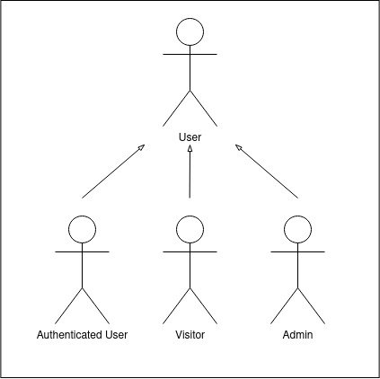

# lbaw 2292

# ER: Requirements Specification Component

To sell you what you don’t know you want.

## A1: All Things Good Online

The main goal for this project being developed by a small indie company, akin to something like amazon and other online shopping websites, is to deliver a web-based information system focused on the cataloging and selling of books, shoes, Knick knacks and any other similarly sorted items and collectables. As such, we intend to have any number of users be able to access the catalogs for any of those items, check their availability and if they’re so incline to, buy any number of said items.    
Our system will allow two distinct user groups, the buyers, who can anonymously add and remove items from their shopping carts trough the browsing and searching they do of our product catalogs, that can be filtered by categories, they’ll also be able to check said products details and reviews left by other users, in addition to this,  said users can register themselves in our platform, gaining the ability to manage their own accounts, make cancelable purchases with tracking, view their purchase history, manage their Wishlist and leave editable reviews of products they have bought, they will also have access to a notifications system for payment statuses, changes to products on their Wishlist and cart along with changes to their orders processing stages.   
The second user group will be the administrators of our system, who will manage the store’s catalog, by editing the products information, stocks and categories, they’ll also have managerial functions over the users accounts, view user’s purchases history and manage order statuses. (It is important to clarify that these two user groups do not intersect.)

---

## A2: Actors and User stories

*This artifact contains the specification of the actors and their user stories, serving as agile documentation of the project’s requirements.*

## 1. Actors

For the All Thnigs Good Online project ,the actors are represented in Figure 1 and described in Table 1.

Figure 1: Actors

| **Identifier** | **Description** |
|----------------|-----------------|
|User|Generic user that has access to public information|
|Visitor|Unauthenticated user that can register himself (sign-up) or sign-in in the system|
|Authenticated User|Registered user that can purchase items and make reviews|
|Admin|Authenticated user that is responsible for the management of users and for some specific supervisory and moderation functions|

Table 1: Actors description

## 2. User Stories

For the All Things Good Online project, consider the user stories that are presented in the following sections.

#### 2.1 User:

| **Identifier** | **Name** | **Priority** | **Description** |
|------------|------|----------|-------------|
|FR.101|List viewing|High|As a User, I want to access the website and be prompted with a list of items, so that I can see the highlights from the shop.  |
|FR.103|View product details|High|As a User, I want to select an item and see more information, so that I can be more informed about it.|
|FR.105|Adding products to Shopping cart|High|As a User, I want to add items to my cart, so that I can then buy them.|
|FR.106|Shopping cart management|High|As a User, I want to manage my cart, so that I can edit the quantity of items I’m going to buy. |
|FR.107|Product searching|High|As a User, I want to search for a specific item, so that I can add the exact item I want to my cart.|
|FR.031|Exact match Search|High|As a User, I want to search for an exact item, so that I can find the exact product instantly.|
|FR.032|Full-text Search|High|As a User, I want to be shown a wide selection of results for a single item search.|
|FR.033|Search over multiple Attributes|Medium|As a User, I want to be able to search for various attributes, so that I see several items related to them.|
|FR.034|Search filters|Medium|As a User, I want to be able to search using filters, so that I can tailor my search.|
|FR.051|Placeholders in Form Inputs|Medium|As a user I want to be given hints when filling a form, so that I can give the correct information on the first try and have a better experience on the site.|
|FR.052|Contextual Error Messages|Medium|As a user I want to be warned of errors when interacting with the site, so that I can be informed that something I’m doing is wrong.|
|FR.053|Contextual Help|Medium|As a user I want to have helping guides when interreacting with the site, so that I can perform my task in a speedier fashion and with less mishaps.|
|FR.061|About Us|Medium|As a User, I want to be able to see information about the website, so that I can be more informed about it.|
|FR.062|Main Features|Medium|As a User, I want to be prompted to a page to see the main features, so that I know what actions I’m able to perform.|
|FR.063|Contacts|Medium|As a User, I want to see the contacts from the people that developed and maintain the website, so that I can know who they are.|
|FR.102|Browse Product categories|Medium|As a User, I want to search items by category, so that I can see all items related to a specific category.|
|FR.104|View product reviews|Medium|As a User, I want to select an item and see its reviews, so that I can see what people think about it.|
|FR.035|Ordering of results|Low|As a User, I want to be able to order the results I’m shown, so that I can customize them to my liking.|

#### 2.2 Visitor:

| **Identifier** | **Name** | **Priority** | **Description** |
|------------|------|----------|-------------|
|FR.011|Login|High|As a visitor, I want to be able to log in to my account, so that I can use its features.|
|FR.012|Registration|High|As a visitor, I want to be able to register myself, so that I have an account and can have access to more features.|
|FR.013|Recovering Password|Medium|As a visitor, I want to recover the password of my account, so that if I forget it my account isn’t lost.|

#### 2.3 Authenticated user:

| **Identifier** | **Name** | **Priority** | **Description** |
|------------|------|----------|-------------|
|FR.205|Checkout|High|As a Authenticated User, I want to check out my cart, so that I can finalize the purchase of my items.|
|FR.021|Viewing profile|High|As a Authenticated User, I want to view my profile, so that I can verify that all my information is correct.|
|FR.022|Editing profile|High|As a Authenticated User, I want to edit my information, so that if any changes in my life occur, I can correct the info on the website.|
|FR.201|View purchase history|High|As a Authenticated User, I want to see my history, so that I can recall what items I have purchased.|
|FR.023|Profile picture Support|Medium|As a Authenticated User, I want to be able to put a picture in my profile, so that I’m more recognizable.|
|FR.014|Deleting account|Medium|As a Authenticated User, I want to be able to delete my account, so that if I don’t agree with the ToS I can have it removed from the site.|
|FR.024|Personal Notifications|Medium|As a Authenticated User, I want to be able to receive personal notifications, so that I can be notified of events occurring on the website.|
|FR.202|Adding products to Wishlist |Medium|As a Authenticated User, I want to add an item to my Wishlist, so that I can save items that I’ll want to buy in the future.|
|FR.203|Wishlist management|Medium|As a Authenticated User, I want to manage my Wishlist, so that I can remove items when I don’t want them anymore.|
|FR.204|Product review|Medium|As a Authenticated User, I want to review items, so that I can give my opinion to other people.|
|FR.301|Edit reviews|Medium|As a Authenticated User, I want to edit my reviews, so that I can adjust it to better reflect my opinion.|
|FR.302|Remove reviews|Medium|As a Authenticated User, I want to remove my reviews, so that if I don’t like the ones I made I can delete them.|
|FR.401|Review Purchased Product|Medium|As a Authenticated User, I want to leave a review over an item I have purchased, so that people can know from an owner how good or bad the item is.|
|FR.402|Order tracking|Medium|As a Authenticated User, I want to track my order, so that I can see where my items are and how long they’ll take to arrive.|
|FR.403|Canceling an Order|Medium|As a Authenticated User, I want to cancel my order, so that I don’t receive a purchase I no longer want.|
|FR.501|Payment approved|Medium|As a Authenticated User, I want to receive a notification when I finalize my purchase, so that I know my payment was successful.|
|FR.502|Change in order processing stage|Medium|As a Authenticated User, I want to receive notifications every time my order switches stages, so that I can be better informed on its whereabouts.|
|FR.503|Availability of products on Wishlist |Medium|As a Authenticated User, I want to receive a notification when an item I have saved in my list becomes available so that I can purchase it.|
|FR.504|Product’s price change inside the cart|Medium|As a Authenticated User, I want to receive a notification when the price of an item I have in my cart receives an update, so that I can be informed and decide if I still want to purchase it.|
|FR.211|Account credits management|Low|As a Authenticated User, I want to be able to add credits to my account, so that I don’t have to use my credit card directly.|
|FR.212|Product recommendations|Low|As a Authenticated User, I want to get product recommendations, so that I can see more items like the ones I previously purchased.|
|FR.213|Multiple payment methods management|Low|As a Authenticated User, I want to manage my payment methods, so that I can have a more convenient method to pay with.|
|FR.214|Report reviews|Low|As a Authenticated User, I want to report unrelated reviews, so that I can be better informed with relevant reviews.|
|FR.025|Appeal for Unblock|Low|As a Authenticated User, I want to be able to appeal to be unblocked, so that if my account gets banned, I can ask an administrator to review my ban and possibly overturn it.|
|FR.015|Logout|High|As a Authenticated User, I want to be able to be able to logout of my account, so that others cannot use it without my knowledge.|

#### 2.4 Administrator:

| **Identifier** | **Name** | **Priority** | **Description** |
|------------|------|----------|-------------|
|FR.042|Administer user accounts|High|As an Administrator, I want to administer my user’s accounts, so that I can check if they have broken any rules.|
|FR.601|Adding products|Medium|As an Administrator, I want to add an item to the list of available items, so that I can sell it.|
|FR.602|Managing product information|Medium|As an Administrator, I want to manage the information of items, so that I can keep the information current and accurate.|
|FR.603|Managing product stock|Medium|As an Administrator, I want to manage the items stock, so that no Authenticated User buys an item that’s unavailable.|
|FR.604|Managing product categories|Medium|As an Administrator, I want to manage items categories, so that users can more easily search for them.|
|FR.605|Viewing of user’s purchase histories|Medium|As an Administrator, I want to see the user purchase histories, so that I can recommend similar items.|
|FR.606|Managing order status|Medium|As an Administrator, I want to manage the order’s status of all purchases, so that I can check that everything went right.|
|FR.041|Administrator accounts|Medium|As an Administrator, I want to have an administrator account so that I can perform my tasks of managing the website.|
|FR.043|Block and unblock User accounts|Medium|As an Administrator, I want to block and unblock my user ‘s accounts, so that if they are breaking any site rules or if they haven’t, I can fix the problem.|
|FR.044|Delete User accounts|Medium|As an Administrator, I want to be able to delete user’s accounts, so that if a user has been blocked several times and keeps breaking ToS, he is banned.|
|FR.611|View Sales Statistics|Low|As an Administrator, I want to see the sales statistics, so that I can better manage popular items stocks.|
|FR.612|Managing products discounts|Low|As an Administrator, I want to manage item liquidation using discounts, so that I can sell items that aren’t selling much.|
|FR.613|Manage Reports|Low|As an Administrator, I want to manage all reports, so that I can see if they are valid, or users are abusing the system and reporting reviews they don’t agree with.|
|FR.016|Logout|High|As a Administrator, I want to be able to be able to logout of my account, so that others cannot use it without my knowledge.|

## 3. Supplementary requirements

#### 3.1 Business rules:

| **Identifier** | **Name** | **Priority** | **Description** |
|------------|------|----------|-------------|
|BR.011|Data saved after account deletion |Medium|As an Administrator, I want the shared user data to remain on the website anonymously, so that all reviews, comments, and likes are to remain on the website, after an account has been deleted.|
|BR.101|Administrator separation.|Medium|As an Owner, I want the accounts of my Administrators and Users to be separate, so that Administrators can’t buy items.|
|BR.013|Commenting own reviews|Medium|As an owner, I don’t want users to be able to comment or report their own reviews, so that the users cannot false flag their own reviews.|
|BR.012|Delivery dates|Medium|As an owner, I want the delivery dates of orders placed on my website to be always greater or equal to the date the order was placed on, so that no order has a delivery date less than the order date itself.|

#### 3.2 Technical requirements:

| **Identifier** | **Name** | **Priority** | **Description** |
|------------|------|----------|-------------|
|TR.01|Performance|High|As a User, I want the website to always have a response time shorter than 2 seconds, so that the website is always responsive.|
|TR.02|Robustness|High|As a User, I want the website to continue to run even when there are runtime errors, so that the website has little to low downtime.|
|TR.03|Scalability|High|As a User, I want my website to always run, so that if there are a lot of people on a server the website doesn’t crash.|
|TR.04|Accessibility|Medium|As a User, I want the website to be accessible by everyone, so that people with any type of handicap can still use it.|

#### 3.2 Restrictions :

| **Identifier** | **Name** | **Priority** | **Description** |
|------------|------|----------|-------------|
|RR.01|Project deadline|High|As an owner, I want the project to be finished by the deadline, so that there are no overbudget reports to the stakeholders. |

## A3: Information Architecture

*This artifact presents a brief overview of the information architecture of the system to be developed. It has the following goals:*

1. *Help to identify and describe the user requirements, and raise new ones;*
2. *Preview and empirically test the user interface of the product to be developed;*
3. *Enable quick and multiple iterations on the design of the user interface.*

*This artifact includes two elements:*

1. *A sitemap, defining how the information is organized in pages;*
2. *A set of wireframes, defining the functionality and the content for each page. Wireframes are designed for at least two of the most important pages.*

### 3.1 Sitemap

*A sitemap is a visual representation of the relationship between the different pages of a website that shows how all the information fits together. The sitemap includes all planned pages and provides a high-level view of how the information space is organized.*

*In a sitemap, each box represents an individual page, and only the main navigational paths are represented as links (i.e., not all possible paths are included). Individual pages may be grouped to represent areas of related features (e.g., administration area). Page stacks may be used to indicate a group of functionally identical pages (e.g., ‘view user profile’).*

The All Things Good Online system is organized in five main areas, the static pages that provide general information about the system (Static Pages), the pages used to explore and access the product catalog(Item Library), the individual user page and cart belonging to that user, the pages with administration features(Admin Pages) and the pages related to user authentication

Figure 1: Sitemap

### 3.2 Wireframes

*Wireframes are used to describe layout ideas, content, and the overall page-level design. A page wireframe defines how space is allocated and how content is prioritized, including which features are available.*

For the All Things Good Online system, the wireframes for the login page (UI12) and the Product details (UI14) are presented in Figures 2 and 3, respectively.

Figure 2: Login Wireframe

Figure 3: Product Wireframe

Figure 4: Cart Wireframe

---

## Revision history

Changes made to the first submission:
1.	Made on 25/10/2022 (Diogo Nunes)  
 	- updated actors diagram  
	- removed all references to "shopper"  
	- moved FR.012 to visitor  
	- added "visitor" to the visitor user stories  
	- updated sitemap diagram   
1. ...

---

GROUP2292, 02/10/2022

* Diogo Nunes, up202007895@fc.up.pt (Editor)
* Diogo Almeida, up202006059@fc.up.pt
* Francisco Nunes,up201908253@fc.up.pt
* Rafael Morgado, up201506449@fc.up.pt (Editor)