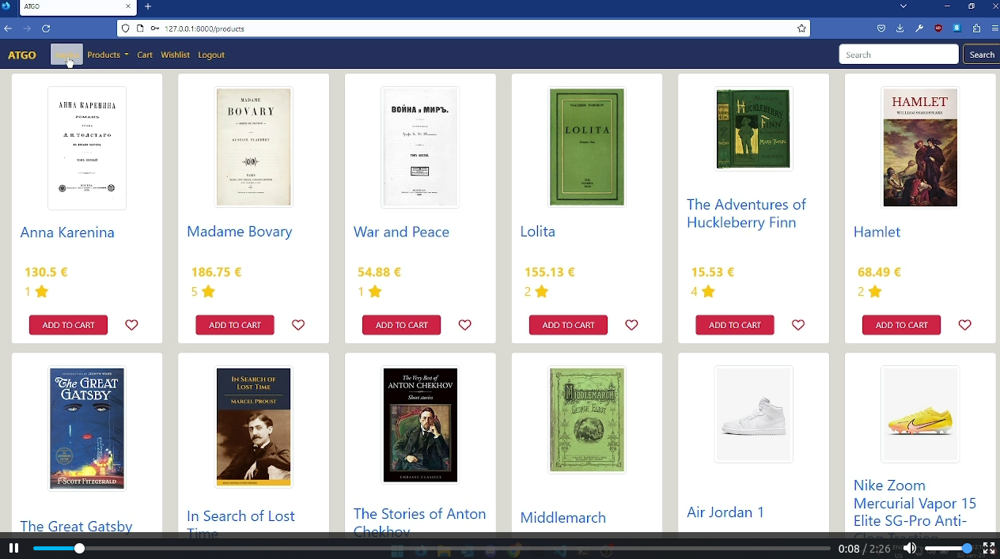

  # PA: Product and Presentation

  ## A9: Product

  The purpose of this project was to develop a web application for a store, called ATGO. In order to have a great product diversity, the store sells multiple kinds of products.

  ATGO is based on HTML5, JavaScript, and CSS. The Bootstrap framework to develop the front-end and the back-end was developed using Laravel. Mailtrap is used for testing email related features.

  The platform has an adaptive design and a detailed navigation system by arranging the products through categories. In order to provide a reliable service, each product has a review section, which allows users to not only review the items they purchased but also to view other people's opinions. Each review includes a score and a short description, which results in the product to have an average score. Besides, users have the ability to save favorite products in a wishlist and view the history of all previous purchases.

  Finally, users are distributed in three groups with different permissions: administrators, unauthenticated and authenticated users.

  ### 1. Installation 

  To run the product locally, either be on FEUP, or use a VPN connection to it, and run the following command.

  ```
  docker run -it -p 8000:80 --name=lbaw2292 -e DB_DATABASE="lbaw2292" -e DB_SCHEMA="lbaw2292" -e DB_USERNAME="lbaw2292" -e DB_PASSWORD="VvWaretj" git.fe.up.pt:5050/lbaw/lbaw2223/lbaw2292 # 
  ```

  #### 1.1 Final release source code

  The final release can be found here, on this repository

  ### 2. Usage

  URL to the product: https://lbaw2292.lbaw.fe.up.pt/

  #### 2.1. Administration Credentials

  [Administration page](https://lbaw2292.lbaw.fe.up.pt/adminDashboard?)  

  | Username | Password |
  | -------- | -------- |
  | asuka@mail.com    | 123123 |


  #### 2.2. User Credentials

  | Type          | Username  | Password |
  | ------------- | --------- | -------- |
  | Banned account | shinji@mail.com    | 123123 |
  | Regular account   | rei@mail.com    | 123123 |


  #### 2.3. Email Credentials

  To test all email related features you must log in to [mailtrap](https://mailtrap.io/) with the following credentials:

  wifacir917@letpays.com
  lbaw2292

  ### 3. Application Help


  Some basic help has been implemented in the following link.

  https://lbaw2292.lbaw.fe.up.pt/faq

  ### 4. Input Validation

  Input data is validated in all registration/login, as well as profile editing and product adding/editing, with both client-side and server side validation.


  ```php
  $this->validate($request, [
                  'name'               => 'required|string|max:255',
                  'price'              => 'required|numeric',
                  'stock_quantity'     => 'required|integer',
                  'url'                => 'image|mimes:jpeg,png,jpg,gif|max:2048',
                  'description'        => 'required|string|max:2048',
                  'year'               => 'required|integer',
                  'sku'                => 'required|string',
              ]);
  ``` 

  In the above code, we validate that the inserted parameters of a new product are all correct.

  ```html
  <div class="mb-3">
              <label for="name" class="form-label">Name </label>
              <input type="text" name="name"  class="form-control bg-info bg-opacity-10 border border-primary" id="name" aria-describedby="name"  required autofocus>
            </div>

            <div class="mb-3">
              <label for="price" class="form-label">Price </label>
              <input type="number" name="price"  class="form-control bg-info bg-opacity-10 border border-primary" id="price"  min="0.01" step="0.01" required>
            </div>


            <div class="mb-3">
              <label for="stock_quantity" class="form-label">Stock </label>
              <input type="number" name="stock_quantity"  class="form-control bg-info bg-opacity-10 border border-primary" id="stock"  min="1" step="1" required>
            </div>


            <div class="mb-3">
              <label for="sku" class="form-label">SKU </label>
              <input type="text" name="sku"  class="form-control bg-info bg-opacity-10 border border-primary" id="sku"  required>
            </div>


            <div class="mb-3">
              <label for="year" class="form-label">Year </label>
              <input type="number" name="year"  class="form-control bg-info bg-opacity-10 border border-primary" id="year"  min="1900" step="1" required>
            </div>


            <div class="mb-3">
              <label for="url" class="form-label">Upload a product picture</label>
              <input type="file" name="url" class="form-control bg-info bg-opacity-10 border border-primary" id="url" accept=".jpeg,.png,.jpg,.gif" >
            </div>

            <div class="mb-3">
              <label for="description" class="form-label">Item description</label>
              <textarea id="confirmationText" class="text form-control mb-3" cols="86" rows ="3" name="description" form="insertForm"></textarea>
            </div>
  ```

  And here we have the client side validation of new product form.

  ### 5. Check Accessibility and Usability

  Accessibility results: [15/18](https://git.fe.up.pt/lbaw/lbaw2223/lbaw2292/-/blob/49902386cdb193599ba558dd30ad62d4cccc3782/reports/Checklist%20de%20Acessibilidade%20-%20SAPO%20UX.pdf)

  Usability results: [18/28](https://git.fe.up.pt/lbaw/lbaw2223/lbaw2292/-/blob/49902386cdb193599ba558dd30ad62d4cccc3782/reports/Checklist%20de%20Usabilidade%20-%20SAPO%20UX.pdf)

  ### 6. HTML & CSS Validation


  HTML:
  * [Main page](https://git.fe.up.pt/lbaw/lbaw2223/lbaw2292/-/blob/49902386cdb193599ba558dd30ad62d4cccc3782/reports/main_page_html_validation.pdf)
  * [Product page](https://git.fe.up.pt/lbaw/lbaw2223/lbaw2292/-/blob/49902386cdb193599ba558dd30ad62d4cccc3782/reports/product_page_html_validation.pdf)
  * [User page](https://git.fe.up.pt/lbaw/lbaw2223/lbaw2292/-/blob/49902386cdb193599ba558dd30ad62d4cccc3782/reports/user_page_html_validation.pdf)


  [CSS](https://git.fe.up.pt/lbaw/lbaw2223/lbaw2292/-/blob/49902386cdb193599ba558dd30ad62d4cccc3782/reports/css_validation.pdf)

  ### 7. Revisions to the Project


  ### 8. Web Resources Specification

  OpenAPI file is [here](https://git.fe.up.pt/lbaw/lbaw2223/lbaw2292/-/blob/49902386cdb193599ba558dd30ad62d4cccc3782/a9_openapi.yaml)


  ```yaml
  openapi: 3.0.0

  info:
   version: '2'
   title: 'LBAW ATGO Web API'
   description: 'Web Resources Specification (A7) for ATGO'

  servers:
  # Added by API Auto Mocking Plugin
  - url: https://lbaw.fe.up.pt
    description: Production server

  externalDocs:
   description: Find more info here.
   url: https://web.fe.up.pt/~ssn/wiki/teach/lbaw/medialib/a07

  tags:
   - name: 'M01: Authentication and Profile'
   - name: 'M02: User Administration and Static pages'
   - name: 'M03: Store'
   - name: 'M04: Reviews'
   - name: 'M05: Cart'

  paths:
   /login:
     get:
       operationId: R101
       summary: 'R101: Login Form'
       description: 'Provide login form. Access: PUB'
       tags:
         - 'M01: Authentication and Profile'
       responses:
         '200':
           description: 'Ok. Show Log-in UI'
     post:
       operationId: R102
       summary: 'R102: Login Action'
       description: 'Processes the login form submission. Access: PUB'
       tags:
         - 'M01: Authentication and Profile'

       requestBody:
         required: true
         content:
           application/x-www-form-urlencoded:
             schema:
               type: object
               properties:
                 email:
                   type: string
                 password:
                   type: string
               required:
                    - email
                    - password

       responses:
         '302':
           description: 'Redirect after processing the login credentials.'
           headers:
             Location:
               schema:
                 type: string
               examples:
                 302Success:
                   description: 'Successful authentication. Redirect to product page'
                   value: '/products'
                 302Error:
                   description: 'Failed authentication. Redirect to login form.'
                   value: '/login'

   /logout:

     post:
       operationId: R103
       summary: 'R103: Logout Action'
       description: 'Logout the current authenticated user. Access: USR, ADM'
       tags:
         - 'M01: Authentication and Profile'
       responses:
         '302':
           description: 'Redirect after processing logout.'
           headers:
             Location:
               schema:
                 type: string
               examples:
                 302Success:
                   description: 'Successful logout. Redirect to login form.'
                   value: '/login'

   /register:
     get:
       operationId: R104
       summary: 'R104: Register Form'
       description: 'Provide new user registration form. Access: PUB'
       tags:
         - 'M01: Authentication and Profile'
       responses:
         '200':
           description: 'Ok. Show Sign-Up UI'

     post:
       operationId: R105
       summary: 'R105: Register Action'
       description: 'Processes the new user registration form submission. Access: PUB'
       tags:
         - 'M01: Authentication and Profile'

       requestBody:
         required: true
         content:
           application/x-www-form-urlencoded:
             schema:
               type: object
               properties:
                 name:
                   type: string
                 email:
                   type: string
                 password:
                   type: string
               required:
                                      - name
                                      - email
                                      - password
                                      

       responses:
         '302':
           description: 'Redirect after processing the new user information.'
           headers:
             Location:
               schema:
                 type: string
               examples:
                 302Success:
                   description: 'Successful authentication. Redirect to products page.'
                   value: '/products/'
                 302Failure:
                   description: 'Failed authentication. Redirect to login form.'
                   value: '/login'

   /users/{id}:
     get:
       operationId: R106
       summary: 'R106: View user profile'
       description: 'Show the individual user profile. Access: USR'
       tags:
         - 'M01: Authentication and Profile'

       parameters:
         - in: path
           name: id
           schema:
             type: integer
           required: true

       responses:
         '200':
           description: 'Ok. Show User Profile UI'
   
   /showOrders:
     get:
       operationId: R107
       summary: 'R107: View user purchase history'
       description: 'Show the individual user purchase history. Access: OWN'
       tags:
         - 'M01: Authentication and Profile'
       parameters:
         - in: path
           name: id
           schema:
             type: integer
           required: true
           
       responses:
         '200':
           description: 'Ok. Show User Purchase History UI'

   /search:
     get:
       operationId: R201
       summary: 'R201: Search products API'
       description: 'Searches for products Access: PUB.'

       tags:
         - 'M03: Store'

       parameters:
         - in: query
           name: query
           description: String to use for full-text search
           schema:
             type: string
           required: false
       responses:
         '200':
           description: Success
           content:
             application/json:
               schema:
                 type: array
                 items:
                   type: object
                   properties:
                     id:
                       type: string
                     name:
                       type: string
                     price:
                       type: string
                     score:
                       type: string
                     description:
                       type: string
                     gender: 
                       type: string
                 example:
                   - id: 1
                     name: Nike shoe
                     price: 27.69
                     score: 4
                     PrimaryColor:  Grey
                     SecondaryColor:  Grey
                     sizeEU: 40
   /products/{id}:
     get:
      operationId: R202
      summary: 'R202: View product details'
      description: 'Show the page with the information of a product . Access: PUB'
      tags:
       - 'M03: Store'

      parameters:
       - in: path
         name: id
         schema:
           type: integer
         required: true

      responses:
       '200':
         description: 'Ok. Show Product UI'
       '400':
         description: 'Product not found'

   /products/:
     get:
      operationId: R203
      summary: 'R203: View products'
      description: 'Show the page a list of a products . Access: PUB'
      tags:
       - 'M03: Store'

      responses:
       '200':
         description: 'Ok. Show Product UI'
       '400':
         description: 'Product not found'
         
   /cart:
      get:
       operationId: R401
       summary: 'R401: View cart of the user'
       description: 'Show the page with the cart of a user . Access: OWN'
       tags:
        - 'M05: Cart'

       parameters:
        - in: path
          name: id
          schema:
            type: integer
          required: true

       responses:
        '200':
          description: 'Ok. Show Cart UI'
          
   /api/cart:
     post:
      operationId: R402
      summary: 'R402: Add product to cart'
      description: 'AJAX Request: Adds a chosen quantity of a produt to the cart of a user. Access: OWN'
      tags: 
       - 'M05: Cart'
       
      requestBody:
        required: true
        content:
          application/json:
           schema:
            type: object
            properties:
              id:
                type: integer
              quantity:
                type: integer
        
      responses:
        '200':
         description: 'Sucessfully added the product to the cart'
        '400':
         description: 'You must login to perform this action'
        '404':
         description: 'Product not found'
        '500':
         description: 'Product already in cart'
     
     /api/cart/: 
      operationId: R403
      summary: 'R403: Change quantity of product in cart'
      description: 'AJAX request. Updates the quantity of a product in the cart of a user. Access: OWN'
      tags:
        - 'M05: Cart'

      requestBody:
        required: true
        content:
          application/json:
            schema:
             type: object
             properties:
              id:
               type: integer 
              quantity:
               type: integer
        
      responses:
        '200':
          description: 'Sucessfully updated item quantity.'
        '404':
          description: 'Product not in the cart'
        '400':
          description: 'Error updating product cart'
       
   /checkout:
    get:
     operationId: R404
     summary: 'R404: Checkout Form'
     description: 'Provide checkout form. Access: USR'
     tags:
      - 'M05: Cart'
     responses:
          '200':
           description: 'Ok. Show checkout form'
    post:
      operationId: R405
      summary: 'R405: Checkout'
      description: 'Processes the checkout. Access: OWN'
      tags: 
       - 'M05: Cart'
       
      requestBody:
          required: true
          content:
           application/x-www-form-urlencoded:
            schema:
             type: object
             properties:
               address:
                type: object
                properties:
                 street:
                  type: string
                 postal_code:
                  type: string
                 city: 
                  type: string
                 country:
                  type: string
             required:
              - address
      responses:
       '302':
        description: 'Redirect after processing checkout form'
        headers:
         Location:
          schema:
           type: string
          examples:
           302Success:
            description: 'Successful checkout. Redirect to home page.'
            value: '/home'
           302Failure:
            description: 'Failed checkout. Redirect to checkout.'
            value: '/checkout'
            
          
   /about:
     get:
      operationId: R501
      summary: 'R501: View About page'
      description: 'Shows the About page. Access: PUB'
      tags: 
       - 'M02: User Administration and Static pages'
       
        
      responses:
        '200':
          description: 'OK. Show About page'
    
   /faq:
     get:
      operationId: R502
      summary: 'R502: View FAQ page'
      description: 'Shows the FAQ page. Access: PUB'
      tags: 
       - 'M02: User Administration and Static pages'
          
      responses:
       '200':
         description: 'OK. Show FAQ page'
           
   /contacts:
     get:
      operationId: R503
      summary: 'R503: View Contacts page'
      description: 'Shows the Contacts page. Access: PUB'
      tags: 
       - 'M02: User Administration and Static pages'
         
          
      responses:
       '200':
         description: 'OK. Show Contacts page'
         
  ...
  ...
  ```

  ### 9. Implementation Details

  #### 9.1. Libraries Used

  We used the following libraries and frameworks:
  * [Bootstrap](http://getbootstrap.com): an open source toolkit for developing with HTML, CSS, and JS.
  * [Laravel](https://laravel.com): a PHP Framework For Web Artisans.
  * [Font Awesome](https://fontawesome.com): icon set and toolkit.

  All of these are used all over the project.

  #### 9.2 User Stories

  | US Identifier | Name    | Module | Priority                       | Team Members               | State  |
  | ------------- | ------- | ------ | ------------------------------ | -------------------------- | ------ |
  |  FR.011          |Login | Module 01 | High | **Diogo Nunes** ,Rafael Morgado  |  100%  |
  |  FR.015          | Logout | Module 01 | High | **Diogo Nunes** ,Rafael Morgado                        |   100%  | 
  |  FR.012          | Registration | Module 01 | High | **Diogo Nunes** ,Rafael Morgado                         |   100%  |
  |  FR.101          | List viewing | Module 03 | High | **Diogo Nunes**                         |   100%  | 
  |  FR.103          | View product details | Module 03 | High | **Diogo Nunes**,Rafael Morgado                       |   100%  | 
  |  FR.021          | Viewing profile | Module 01 | High | **Diogo Nunes** ,Rafael Morgado          |   100%  | 
  |  FR.022          | Editing profile | Module 01 | High | **Diogo Nunes**                         |   100%  | 
  |  FR.061          | About Us | Module 02 | Medium | **Diogo Almeida** , Diogo Nunes                        |   100%  | 
  |  FR.063          | Contacts | Module 02 | Medium | **Diogo Almeida**, Rafael Morgado                   |   100%  | 
  |  FR.041          | Administrator accounts | Module 02 | Medium | **Diogo Nunes**,Diogo Almeida                        |   100%  | 
  |  FR.042          | Administer user accounts | Module 02 | High | **Diogo Nunes**                         |   60%  | 
  |  FR.601          | Adding products | Module 03 | Medium | **Diogo Nunes**,Diogo Almeida                      |   100%  | 
  |  FR.201          | View purchase history | Module 01 | High | **Diogo Almeida** ,Rafael Morgado                       |   75%  |
  |  FR.105          | Adding products to Shopping cart | Module 03 | High | **Diogo Nunes** ,Rafael Morgado                       |   100%  |
  |  FR.205          | Checkout | Module 03 | High | **Diogo Nunes**                         |   50%  | 
  |  FR.107          | Product searching | Module 03 | High | **Diogo Nunes**                         |   100%  | 
  |  FR.602          | Managing product information | Module 03 | Medium | **Diogo Nunes** ,Diogo Almeida                        |   100%  | 
  |  FR.603          | Managing product stock | Module 03 | Medium | **Diogo Nunes**                         |   100%  | 
  |  FR.204          | Product review | Module 04 | Medium | **Diogo Almeida**,Diogo Nunes                       |   100%  | 
  |  FR.104          | View product reviews | Module 04 | Medium | **Diogo Almeida**  ,Rafael Morgado                       |   100%  | 
  |  FR.014          | Deleting account | Module 01 | Medium | **Diogo Nunes**                         |   100%  |
  |  FR.106          | Shopping cart management | Module 05 | High | **Diogo Nunes**                         |   100%  | 
  |  FR.202          | Adding products to Wishlist | Module 05 | Medium | **Diogo Nunes**                         |   100%  | 
  |  FR.203          | Wishlist management | Module 05 | Medium | **Diogo Nunes**                         |   100%  | 
  |  FR.023          | Profile picture Support | Module 01 | Medium | **Diogo Nunes**                         |   100%  |
  |  BR.101          | Administrator separation | Module 03 | Medium | **Diogo Nunes**                         |   100%  |
  |  FR.052          | Contextual Error Messages | Module 03 | Medium | **Diogo Nunes**                         |   50%  |
  |  FR.102          | Browse Product categories | Module 03 | Medium | **Diogo Nunes**                         |   100%  |
  |  FR.043          | Block and unblock User accounts | Module 02 | Medium | **Diogo Nunes**                         |   100%  |
  |  BR.011          | Data saved after account deletion | Module 02 | Medium | **Diogo Nunes**                         |   100%  |
  |  FR.013          | Recovering Password | Module 01 | Medium | **Diogo Nunes**                         |   100%  |


  ---


  ## A10: Presentation
   
  The purpose of this project was to develop a web application for a store, called ATGO. In order to have a great product diversity, the store sells multiple kinds of products.

  In this section, we will provide an overview of our site's features.

  ### 1. Product presentation

  The purpose of this project was to develop a web application for an online store, called ATGO. In order to have a great product diversity, the store sells multiple  product types, such as Books, Shoes, and Funko Pops.

  ATGO has an adaptive design and a detailed navigation system by arranging the products through categories. The user can search for a product by name using the search bar, or manually look for in categorical pages. In order to provide a reliable service, each product has a review section, which allows users to not only review the items they purchased but also to view other people's opinions. Each review includes a score and a short description, which results in the product to have an average score. Besides, users have the ability to save favorite products in a wishlist and view the history of all previous purchases. The administrator is responsible for managing the products and users of the platform. In this platform, this type of user is free to manage the products' properties and categories in a way he thinks it's best for the website.

  URL to the product: https://lbaw2292.lbaw.fe.up.pt/


 ### [Slides](../reports/Presentation.pdf)


  ### 2. Video presentation

  A short video was produced, showcasing some of the uses of the site, as we couldn´t fit all of the features on a 2 min video.

  


  The video was uploaded by the group in the specified place in the Moodle platform.


  ---


  ## Revision history

  Changes made to the first submission:
  1. Item 1
  1. ..

  ***
  GROUP2292, 03/01/2023

  * Diogo Nunes, up202007895@fc.up.pt (Editor)
  * Diogo Almeida, up202006059@fc.up.pt
  * Rafael Morgado, up201506449@fc.up.pt