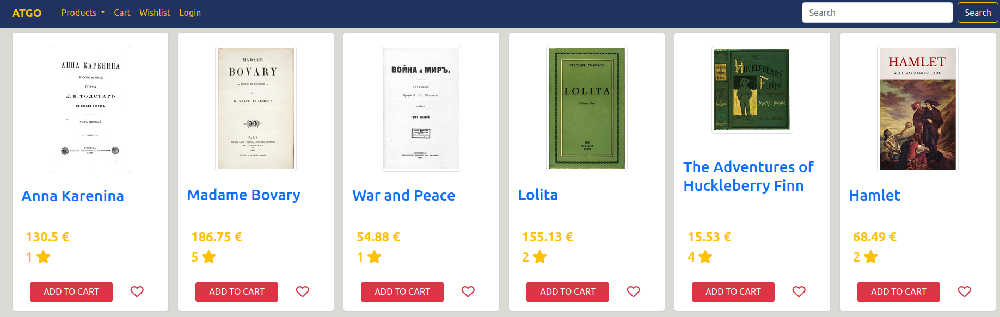
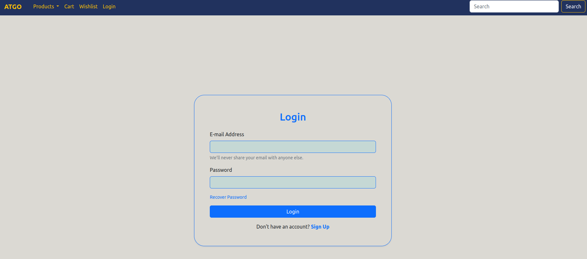
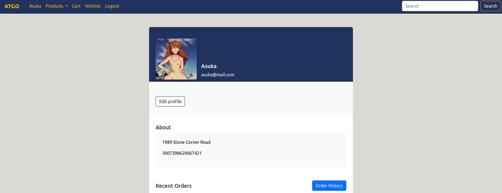
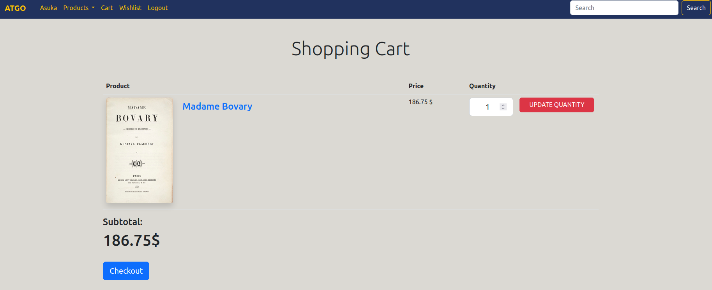
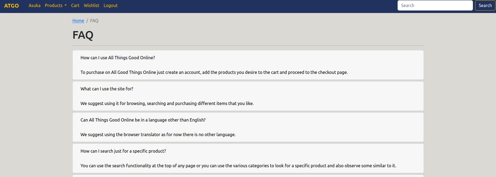

# lbaw2292


## ATGO - All Things Good Online - Webshop


## Description
The purpose of this project was to develop a web application for a store, called ATGO. In order to have a great product diversity, the store sells multiple kinds of products.
ATGO is based on HTML5, JavaScript, and CSS. The Bootstrap framework to develop the front-end and the back-end was developed using Laravel.Mailtrap is used for testing email related features.
The platform has an adaptive design and a detailed navigation system by arranging the products through categories. In order to provide a reliable service, each product has a review section, which allows users to not only review the items they purchased but also to view other people's opinions. Each review includes a score and a short description, which results in the product to have an average score. Besides, users have the ability to save favorite products in a wishlist and view the history of all previous purchases.
Finally, users are distributed in three groups with different permissions: administrators, unauthenticated and authenticated users.


## Visuals
Below you will find some screenshots of some of the pages of the website







## Installation
To run the website locally run the following command :

```
docker run -it -p 8000:80 --name=lbaw2292 -e DB_DATABASE="lbaw2292" -e DB_SCHEMA="lbaw2292" -e DB_USERNAME="lbaw2292" -e DB_PASSWORD="VvWaretj" git.fe.up.pt:5050/lbaw/lbaw2223/lbaw2292 # 
```

Or just run the following

```
php artisan serve
```

Make sure to configure a local postgres SQL server with the right configuration.


## Support
Anyone that wishes to use this code is free to do so, at their own risk, as the team has moved on to other projects.

## Roadmap
There curently is no roadmap.

## Authors and acknowledgment
This project was developed by:
- [Diogo Faia Nunes](https://github.com/ICWeiner)  
- [Rafael Morgado](https://github.com/tomatosauceguy)  
- [Diogo Almeida](https://github.com/letziou)

## License
For open source projects, say how it is licensed.

## Project status
The project has been submited for final evaluation, and so, is now considered completed, even if there are features that were supposed to be implemented
